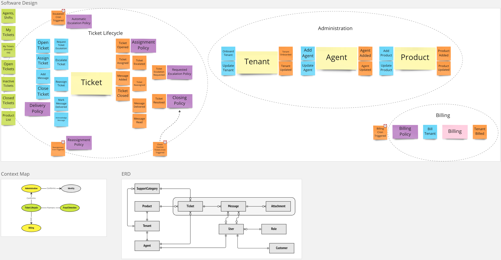

# Ticket Service

This is an implementation of the `Ticket Service` following the Event Storming Model below... *Still a WIP as we evolve the ideas in Miro*

We will be using an experimental TypeScript/NodeJS framework that has been under development since 2022

- <https://github.com/Rotorsoft/eventually-monorepo>
- <https://github.com/Rotorsoft/eventually-monorepo/blob/master/libs/eventually/README.md>

Help is welcome ;-)

## Process Model

## Software Design

## Unit Testing

`yarn test --coverage`

## OpenAPI Spec

`yarn start:dev`

[http://localhost:3000](http://localhost:3000)
